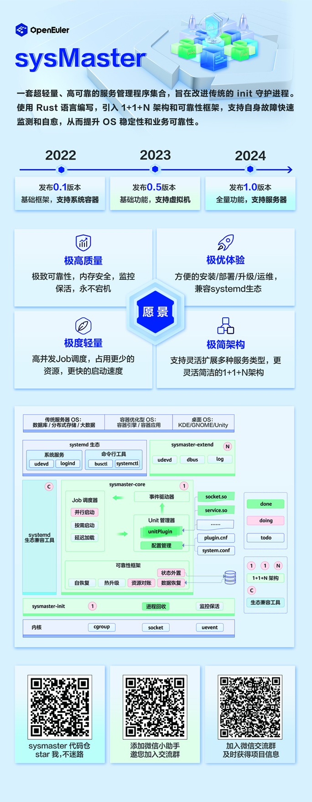

# sysMaster 设计思考

## 背景说明

在所有 Unix 系统中都有一个进程号为 1 的进程。这是操作系统内核完成启动后，执行的第一个用户态应用程序，所以进程号在数值上仅次于 idle 这个特殊进程。

从功能定位上看，init 所负责的最基本功能有两类：

1. 启停系统服务: 比如 init 负责在启动阶段拉起用户空间的各个守护进程，这个过程需要依赖文件系统挂载、设备发现、网络配置等活动。相应的，在系统关闭或者重启过程中，init 同样要负责关闭网络接口，数据落盘，资源清理，卸载文件系统等等。系统关闭过程的不完善，会影响下一次能否成功启动。
2. 回收孤儿进程: 在 Unix 系统上，如果父进程比子进程更早退出，子进程成为孤儿的情况下，init 有回收孤儿进程运行状态的责任。

从用户的角度看，回收孤儿进程是个基本功能，这点如果没做到，系统会出现大量僵尸进程，影响系统稳定性。但更重要的还是对系统服务启停的管理。一个优秀的init进程，应该具备快速、可靠的特性。为达成快速的目的，有几个关键的手段：

- 按需启动：启动时，只启动必须的服务，将其他事务延后到合适的时机（真正需要它的时候），比如更新、上报等服务等到系统空闲的时候再处理。
- 更多的并行：保持足够高的并发度，最大化的利用CPU、内存、带宽资源，使系统快速行进至登陆界面，而不是白白浪费时间。
- 保证每个启动脚本的高性能：避免不必要的fork和脚本。

## 主流init实现方式对比

很多人一直努力地从某些方面改进传统的 init 守护进程，使它变得更完善。有简洁可靠但低效的sysvinit，有高效但略显复杂的systemd。

*todo* 增加对 Android init 的分析对比

| Init软件 | 说明                                                                             | 启动管理 | 进程回收 | 服务管理 | 并行启动 | 设备管理 | 资源控制 | 日志管理 |
| -------- | -------------------------------------------------------------------------------- | -------- | -------- | -------- | -------- | -------- | -------- | -------- |
| sysvinit | 早期版本使用的初始化进程工具,  逐渐淡出舞台。                                    | ✓        | ✓        |          |          |          |          |          |
| upstart  | debian,  Ubuntu等系统使用的initdaemon                                            | ✓        | ✓        | ✓        | ✓        |          |          |          |
| systemd  | 提高系统的启动速度，相比传统的System  V是一大革新，已被大多数Linux发行版所使用。 | ✓        | ✓        | ✓        | ✓        | ✓        | ✓        | ✓        |

## sysmaster设计的目标和约束

**设计目标**

- **极高质量**: 极致的可靠性,内存安全,永不宕机,消减对业务影响;
- **极易使用**：可以方便的安装/部署/升级/运维;
- **极度轻量**：占用更少的资源，更快的启动速度;
- **极简架构**：更灵活简洁的架构，易于理解、便于运维;
- **极致安全**：保持对进程的跟踪，提供最小的运行环境。

## 架构图


## 代码目录结构说明
源码仓库以workspaces方式管理，每一个目录是一个package，每个package包含一个crate（lib或bin形式），
公共lib crate的目录带lib前缀，使用cargo new --lib libtests创建,
daemon类型的bin crate的目录以d结尾。
```
/ (根目录)
|...coms (组件库)
|      |...service (unit type)
|      |...socket  (unit type)
|      |...target  (unit type)
|...libs
|      |...libtest (测试库)
|      |...libcgroup (cgroup)
|...src
|     |...sysmaster (daemon)
|     |...udevd (daemon)
|     |...random-seed (bin)
|...tools
|     |...musl_build
|     |...run_with_sd
|...docs
```

如：
```
  - lib crate: libs/libevent, libs/libutils
  - bin crate: src/init, src/sysmaster
  - daemon crate: src/udevd, src/logind
```
