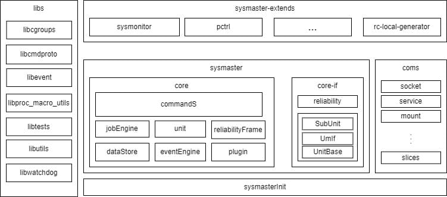

# sysmaster架构设计

## 名词解释

| 术语名称 | 说明                                                           |
| -------- | ----------------------------------------------------------|
| Unit     | SysMaster管理的服务实例                                      |
| SubUnit  | 具体被管理的对象类型，如Service，Socket等等                    |
| Job      | 每个Unit执行时产生的对象，具备事务性，是Unit状态迁移的最小实例     |

## 设计目标

sysmaster是对标systemd, 提供一号进程对系统进行管理的功能，当前主要设计目标为:

1. 兼容性:兼容systemd并为容器，虚拟化，服务器场景提供1号进程以及系统服务管理能力
2. 按需加载，极速启动:现有systemd包含50+服务，在实际使用过程中，有些服务实际并没有用处，但是带来了架构的复杂性，代码结构臃肿，无法修改，启动过程冗余，启动速度有进一步提升的空间
3. 极致可靠性:通过rust语言减少内存类bug，并支持快速恢复能力，1号进程故障，系统不重启
4. 单机负载均衡: 将单机的所有unity(process/container/vm等)统一管理, 最大化单机资源利用率

## 整体架构

Sysmaster核心架构包含UnitManager，DataStore，JobEngine，EventEngine，ProtoServer，Cli命令行。以及基于核心架构扩展出来的SubUnit，以及相关的服务，整体架构如下图:

sysmaster架构如上图，包含以下模块:

1. `sysmaster-init`: 1号进程，保持简单，只盲等待，并定期监听sysmaster-core的心跳，巡检core的状态。

2. `sysmaster-core`:

    - `bin`: 主体程序的代码, 包含以下子模块:

        - `unit`: 系统服务的基本配置单元，系统支持的每种服务就是一种Unit，是symaster的核心单元

        - `dataStore`: 保存系统中所有加载的unit对象，实时更新状态

        - `eventEngine`: 事件驱动引擎，接收外部事件，驱动unit状态机

        - `jobEngine`: 工作任务引擎，unit状态的变化，通过job驱动，job支持事务的概念，支持会滚机制，保障unit状态迁移的原子性。

        - `reliabilityFrame`: 可靠性框架，支持sysmaster的故障恢复，支持故障检查点的动态注入，故障状态的检查，恢复。各个子类需要梳理故障模式库，并且注入故障检查点，一旦发生故障，故障框架会将业务恢复到故障检查点，并重新执行后续动作。

        - `commandS`: 监听接收外部的命令，执行对应的unit动作。

    - `lib`: sysmaster接口层，为core以及coms提供接口

3. `sysmaster-extends`: bin,daemon等扩展功能组件

4. `libs`: 对操作系统通用功能的接口封装，和sysmaster对外提供的功能无关，被sysmaster-extends、sysmaster sysmsater-init依赖。
sysmaster-extends，sysmaster的扩展功能
