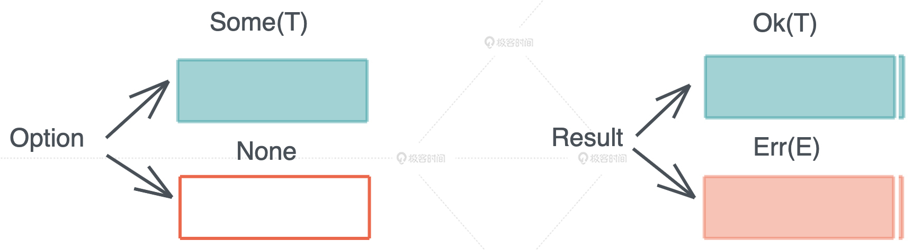
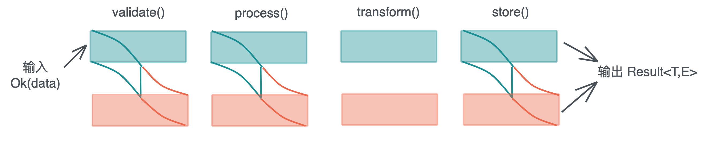

# 对错误处理的思考

## 编程语言的错误处理

错误处理是指在编程语言中, 对程序运行中可能发生的错误（如语法错误、运行时错误、系统错误等）进行处理的过程。不同的编程语言提供了不同的错误处理机制, 如异常处理、错误码、调试信息等。正确的错误处理机制可以有效地帮助开发者定位和修复错误, 并保证程序的稳定性和可靠性, **实际生产过程中, 任何错误都要得到妥善处理, 否则会埋下隐患**, 轻则影响体验, 重则带来安全问题。


对开发者来说, 错误处理包含这么几部分：

1. 当错误发生时, 用合适的错误类型捕获这个错误。
2. 错误捕获后, 可以立刻处理, 也可以传递错误延迟处理。
3. 最后, 根据不同的错误类型, 给用户返回合适的、帮助他们理解问题所在的错误消息。

每当开始一个新项目时, 第一件要考虑的事应该是“我该如何管理错误”。

常见的三种错误处理方式如下：

1. 返回值/错误码: 在程序中通过返回一个整数状态码来表示操作是否成功, 状态码为0表示操作成功, 其他值表示失败, 比较有代表性的时C语言的返回值及errno。
2. 异常和断言: 返回值不利于错误的传播, 使用异常处理机制, 当程序发生错误时, 抛出一个异常, 程序的执行会被中断, 并从调用栈中向上回溯, 直到找到处理该异常的代码。
3. 类型系统: 比较典型的是Rust , 在 Rust 中, 可以使用 Result<T, E> 类型来表示函数的返回结果, 其中 T 表示成功的结果类型, E 表示错误的结果类型。如果函数执行成功, 则返回一个包含成功结果的 Ok 值, 如果执行失败, 则返回一个包含错误结果的 Err 值。

错误处理, 一直是编程语言的一个设计难点, 各种编程语言的错误处理机制都不尽相同, 并且各有优劣.

| **方式**      | **优点**                                                                                    | **缺点**                                                                                                                                                                                |
| ------------- | ------------------------------------------------------------------------------------------- | --------------------------------------------------------------------------------------------------------------------------------------------------------------------------------------- |
| 返回值/错误码 | 简单易用, 易于理解和实现                                                                    | 不易于描述复杂的错误状态, 可读性差, 容易出错（未检查的状态码）如果错误不及时处理, 又会丢掉这个错误信息, 造成隐患。                                                                      |
| 异常和断言    | 能够描述复杂的错误状态, 易于使用, 提高可读性                                                | 程序性能可能降低（抛出和捕获异常的代价）, 不适用于所有编程语言, 需要统一的异常处理机制,**开发者会滥用异常**不适用于检测所有的错误, 不能描述复杂的错误状态, 仅在调试阶段有效(assertions) |
| 类型系统      | 通过返回值返回错误, 但是错误被包裹在一个完整的、必须处理的类型中, 代码可读性好,代码简洁高效 | 需要掌握后,才会带来生产效率的提升.                                                                                                                                                      |

请注意, 不同的编程语言和应用场景可能会有所不同, 因此上述比较仅是一般趋势。


## Rust语言的错误处理

Rust 偷师 Haskell, 构建了对标 Maybe 的 Option 类型和 对标 Either 的 Result 类型。可以说是十分的优雅, 特别体现在对Option和Iterator的交互上, 但是对于新人入门来说需要一定的学习成本。



Option 是一个 enum, 其定义如下：

```rust
pub enum Option<T> {
    None,
    Some(T),
}
```

它可以承载有值/无值这种最简单的错误类型。

Result 是一个更加复杂的 enum, 其定义如下：

```rust
#[must_use = "this `Result` may be an `Err` variant, which should be handled"]
pub enum Result<T, E> {
    Ok(T),
    Err(E),
}
```

当函数出错时, 可以返回 Err(E), 否则 Ok(T)。

此外, Rust还提供?运算符来方便的传递错误, 需要实现 From trait 在二者之间建立起转换的桥梁, 这会带来额外的麻烦。Rust 还为 Option 和 Result 提供了大量的辅助函数, 如 map / map_err / and_then, 你可以很方便地处理数据结构中部分情况。



无论是通过 ? 操作符, 还是函数式编程进行错误处理, Rust 都力求让错误处理灵活高效, 让开发者使用起来简单直观。

对于不可恢复类的错误, 使用 panic! / catch_unwind 来应对,提供了特殊的异常处理能力。

我们讲到 Result<T, E> 里 E 是一个代表错误的数据类型。为了规范这个代表错误的数据类型的行为, Rust 定义了 Error trait：

```rust
pub trait Error: Debug + Display {
    fn source(&self) -> Option<&(dyn Error + 'static)> { ... }
    fn backtrace(&self) -> Option<&Backtrace> { ... }
    fn description(&self) -> &str { ... }
    fn cause(&self) -> Option<&dyn Error> { ... }
}
```

我们可以定义我们自己的数据类型, 然后为其实现 Error trait。如果不借助第三方rust库, 要构筑好自己的Error错误处理是一个繁琐切精细的工作.

## 错误处理中常见问题

在错误处理中, 常见的问题包括：

1. 未考虑所有可能的异常情况
2. 忽略错误信息, 导致难以诊断问题
3. 过于简单的错误处理逻辑, 导致系统不稳定
4. 过于复杂的错误处理逻辑, 导致代码难以维护
5. 对已知错误的不当处理, 导致系统更加不稳定
6. 缺乏对错误跟踪和分析的机制, 导致难以快速定位错误原因
7. 不合理的错误处理策略, 导致系统行为不可预期。

解决错误处理中的问题通常需要以下步骤：

1. 定义错误：确定错误的类型和原因。
2. 收集数据：收集有关错误的信息, 如日志, 调用堆栈和环境变量。
3. 分析数据：分析错误的原因, 以及需要执行哪些步骤来解决问题。
4. 解决问题：使用解决方案, 如代码修复, 配置更改或更新软件。
5. 测试解决方案：验证解决方案是否有效, 并确保错误不再发生。
6. 更新文档：更新错误处理流程的文档, 以便在未来的问题出现时使用。

这些步骤可以通过使用工具, 如调试器, 错误日志分析器和问题跟踪系统等, 来加速和简化。

 除了上面常见的使用问题外,在日常使用过程中,我们在设计错误处理时, 要面临几个比较关键的问题.

1. 多种类型的Error在同一个函数中需要处理时, 必须要有一个共同的可以Into的Error类型作为函数返回值, 比如下面的代码：

```rust
fn foo() -> Result<(), FooError> {
    let one: Result<(), OneError> = fn_one();
    one?;

    let two: Result<(), TwoError> = fn_two();
    two?;

    Ok(())
}
```

 那么FooError必须有实现From<OneError>和From<TwoError>, 惯常的做法是写一个enum将所有的错误都封装起来, 并且实现Display、Debug、Error还有From<T>这几个trait, 手写的话比较枯燥乏味。

1. Error trait的backtrace还未稳定, 虽然说backtrace对性能会有损耗, 但是没有backtrace在遇到错误抛出的时候, 如果错误没有一些明确的信息, 就很难定位到是哪里的代码抛的这个错误, 特别是对于第三方库抛的错误, 对于开发调试和生产排查问题都造成了不便, 在[Fix the Error trait](https://github.com/rust-lang/rust/issues/53487)这个RFC里面有提出。
2. 模块级 Error 类型与全局 Error 类型.模块级 Error 类型： 指的是在单个模块内部使用的错误类型, 只对该模块内的代码有效, 不会影响到其他模块。模块级 Error 类型可以使代码更容易维护和阅读, 并且更容易诊断错误。全局 Error 类型： 指的是在全局范围内使用的错误类型, 对整个程序有效。全局 Error 类型可以使代码具有更高的可移植性, 因为它可以在任何模块中使用, 但它可能会使代码难以维护, 因为所有错误类型都存在于全局范围内。这是在大型工程中经常要面临的问题, 要根据实际情况做出些取舍.

对于上面的问题, Rust界很多很优秀的crates来解决,通过宏来简化Error的定义和使用.

这里重点介绍下两套方案, 两者都对上面问题有自己独到的见解.

- **thiserror + anyhow**

*注意事项：thiserror是给lib使用的, 而anyhow是给bin程序使用, 当然bin程序可以使用thiser+anyhow, 但是切记anyhow不要在lib里面使用。*

```rust
use thiserror::Error;

#[derive(Error, Debug)]
pub enum DataStoreError {
    #[error("data store disconnected")]
    Disconnect(#[from] io::Error),
    #[error("the data for key `{0}` is not available")]
    Redaction(String),
    #[error("invalid header (expected {expected:?}, found {found:?})")]
    InvalidHeader {
        expected: String,
        found: String,
    },
    #[error("unknown data store error")]
    Unknown,
}
```

这个本质上用enum封装的思路, 用derive macro来自动生成的, 节省了很多的时间。

```rust
use anyhow::Result;

fn get_cluster_info() -> Result<ClusterMap> {
    let config = std::fs::read_to_string("cluster.json")?;
    let map: ClusterMap = serde_json::from_str(&config)?;
    Ok(map)
}
```

这里直接将anyhow::Result作为返回值, 因为它直接实现了From<E> where E: Error, 所以无要维护一个enum类型, 但是注意只有在bin程序里面才建议使用.

- **snafu**

snafu方案, 时将context和具体的Error比较优雅的结合起来. 还可以附带更多的错误相关信息, 如io::Error中可以附带PathBuf信息,比thiserror中直接继承更有意义.

```rust
#![allow(unused)]
fn main() {
use snafu::{ResultExt, Snafu};
use std::{fs, io, path::PathBuf};

#[derive(Debug, Snafu)]
enum Error {
    #[snafu(display("Unable to read configuration from {}: {}", path.display(), source))]
    ReadConfiguration { source: io::Error, path: PathBuf },

    #[snafu(display("Unable to write result to {}: {}", path.display(), source))]
    WriteResult { source: io::Error, path: PathBuf },
}

type Result<T, E = Error> = std::result::Result<T, E>;

fn process_data() -> Result<()> {
    let path = "config.toml";
    let configuration = fs::read_to_string(path).context(ReadConfiguration { path })?;
    let path = unpack_config(&configuration);
    fs::write(&path, b"My complex calculation").context(WriteResult { path })?;
    Ok(())
}

fn unpack_config(data: &str) -> &str {
    "/some/path/that/does/not/exist"
}
}
```

不妨通过官网来了解snafu的设计哲学.

- 同样的底层错误可以根据上下文不同而转换为不同的领域特定错误, 例如同样是 io 错误, 根据上层业务语义的不同能够转换为不同的业务错误
- 在库和应用的场景下都同样好用
- 模块级别的 Error 类型, 每个模块都应该定义一个, 甚至多个自己专用的错误类型

## sysMaster错误处理

我们过去熟悉的初始化系统（比如 sysVinit、systemd、upstart）, 大多是使用 C 写的, 且往往因为设计复杂, 功能大一统等有违 UNIX 传统思维的做法而广受诟病。openEuler 社区为社区提供了一个全新的、采用 Rust 编写的初始化系统 —— sysMaster。

和 systemd 相比, 由于 sysMaster 采用 Rust 语言编写, 原生地规避了内存泄漏问题, 开发者无需担心内存泄漏导致的 1 号进程挂掉。而从零构建的 sysMaster, 也摒弃了之前的初始化系统中存在问题, 为开发者提供了**新一代的初始化系统** 。

相比于过去的初始化系统, sysMaster 提供了全新的架构设计, 分为 sysMaster Core 和 sysMaster Extend 两类。sysMaster Core 提供了极度轻量的调度方式, 占用更少的资源, 以及更快的启动速度。拆分的架构则可以支持拓展多种服务类型, 实现 1+1+N 的架构, 满足初始化系统的多样化诉求。而它的生态兼容工具, 则可以让开发者可以自由选择 systemd 和 sysMaster, 无需担心被生态绑定。

先摆观点,sysMaster中的错误处理要遵循下面的原则.

1. **Error类型尽量做到模块级别,** **类型定义尽量内聚且避免语义重复**
2. **建议使用snafu, 按crate单独定义对应的error.rs, 尽量避免函数级或文件级粒度**

鉴于sysMaster大型软件的属性及独有的设计, 这是不使用全局的Error的原因, 因为会导致整个项目耦合比较高,不易维护.

下面重点阐述如何在项目中应用这些原则.

- 不会定义全局的error lib, 每个crate定义自己的error.rs, crate内只能使用这个统一的Error, 注意语义不能重复.**sysmaster中,unit coms组件和sysmaster-core在逻辑和功能上共用一个Error,避免频繁的转换**

```rust
//! Error define
use snafu::prelude::*;

/// Event Error
#[derive(Debug, Snafu)]
#[snafu(visibility(pub(crate))] //将可见性限制在内部
#[non_exhaustive] //申明结构体可变,未来添加更多属性
pub enum Error {
    /// An error from IO, can throw with more information
    #[snafu(display("Error(A-Io)"))]
    Io {
        source: std::io::Error,
        words: &'static str,   // 额外的错误信息
        backtrace: Backtrace,
    },

    /// It cannot be processed at this level and needs to be thrown. Be careful not to repeat semantics
    #[snafu(display("Error(event): '{}'.", word))]
    InvalidLoad {
        /// some words
        msg: &'static str,
    },
}
```

- 统一使用snafu来简化Error的定义, 并控制好作用域, 错误尽量在调用的地方同步处理掉, 尽量避免`?`和`unwrap()`.

```rust
//! a_crate/error.rs
#[snafu(visibility(pub)] //将可见性限制在内部
#[non_exhaustive] //申明结构体可变,未来添加更多属性
pub enum Error {
    #[snafu(display("Error(A-Io)"))]
    Io {
        source: std::io::Error,
        words: &'static str,   // 额外的错误信息
        backtrace: Backtrace,
    },
    #[snafu(display("Error(event): '{}'.", word))]
    Other {
        words: &'static str,
    },
}

/// crate内部使用范例
pub fn inner_example() -> std::result::Result<(), Error> {
    std::fs::File::open("./io.rs").context(IoSnafu { word: "todo!()" })?;
    // open函数对应的错误时std::io::Error,否则无法使用context自动转化
    match condition() {
            casea => Ok(()),
            _ => OtherSnafu { words: "some words" },
        	// OtherSnafu定义在crate内部, 需声明#[snafu(visibility(pub(crate)]
        }
    Ok(())
}

//! b_crate/error.rs 依赖a-crate
pub enum Error {
    #[snafu(display("Error(B-Io)"))]
    AError {
        source: a_crate::error::Error,
        more_words: &'static str,   // 使用界面产生更多额外的错误信息
        backtrace: Backtrace,
    },
}

/// 跨crate使用范例
fn example() -> std::result::Result<(), Error> {
    a_crate::inner_expamle().context(AErrorSnafu { more_word: "()" })?;
    // inner_expamle()对应错误时a_crate::error::Error, 否则无法
    // 同时要注意#[snafu(visibility(pub)]定义的a_crate的可见性, 如果使用a_crate::error::Error::Io
    Ok(())
}
```

- snafu其他用法(如backtrace/宏)可以参考[官方文档](https://docs.rs/snafu/latest/snafu/index.html).
