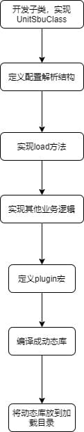

# 扩展子类开发指南

sysmaster为Linux系统下的一号进程，是linux内核启动后第一个用户态进程，在系统启动过程中和关机过程中，完成相关资源的初始化和回收工作：

开机过程中主要完成以下工作：

1. 设备驱动的加载以及以及初始化，如磁盘设备，网络设备等。
2. 文件系统初始化及挂载。
3. 系统配置的初始化，如网络配置等，其他需要在系统启动过程中重新初始化的部分。
4. 随系统启动而自启动的进程的启动。

关机过程主要完成以下工作：
1.资源的回收，如缓存的持久化。
2.业务进程的关闭

sysmaster支撑以上工作，提供可以扩展的开发框架，支持开发多种管理单元（后文称为Unit），完成需要在开机和关机过程中可以方便扩展需要注入的系统启动过程中需要执行的工作，扩展Unit的开发流程如下：

需要启动的进程，初始化的系统配置，如网络配置，
本文当详细描述，如何基于sysmaster开发框架，sysmaster扩展开发新的子类，具体的开发流程如下：



## 子类UnitSubClass实现 ##

子Unit的行为约束通过三个trait来定义，分别是：

```rust
//定义Unit单元所有可以执行的行为，具体的行为列表可以参考代码文件：
//sysmaster/src/manager/unit/unit_entry/u_entry.rs
pub trait UnitObj;

//由于rust不支持面向对象，此trait实现从子Unit到UnitObj的downgrade.
pub trait UnitSubClass;

//将UnitManager（UnitManager是所有子类管理父类，由于rust不支持多态，无法基于基类做转换，所以增加此trait） attach到子类实例上
pub trait UnitMngUtil;

```

1. 前置条件说明

   当前sysmaster采用单线程运行环境，所以各sysmaster管理单元（unit）在实现时需要以异步无阻塞方式编程.

2. 子类行为分类说明
unit作为所管理的系统资源在sysmaster中的投影，unit在通过os接口操作对应系统资源时，同时维护对应系统资源的状态和历史操作结果。

    - 子类生命周期行为：
    根据业务诉求提炼出其所需管理的系统资源，并通过os接口对这些系统资源进行管理，对外提供系统资源的操作接口，包括：start、stop、reload。

    - 子类的状态管理
        - 状态映射
        unit框架为各个子类定义了标准的状态机，并基于此状态驱动Unit的生命周期行为，各个子类Unit也可以实现自己的状态管理，但是需要将自己的状态通过接口映射到unit框架的基础状态，这个通过实现接口

        ```rust
        fn current_active_state(&self) -> UnitActiveState;
        ```

        - 状态驱动
        状态机的驱动，由个子类根据自身的行为来驱动，当子类在变更自己的状态的时候，需要显示的调用unit的notify接口，通知unit，状态发生了变更，来驱动状态机的状态迁移，为方便各类unit实现，notify接口支持重入。

    ```rust
    fn set_state(&self, state: ServiceState) {
        let original_state = self.state();
        *self.state.borrow_mut() = state;
        // check the new state
        if !vec![
            ServiceState::Start,
            ServiceState::StartPost,
            ServiceState::Running,
            ServiceState::Reload,
            ServiceState::Stop,
            ServiceState::StopWatchdog,
            ServiceState::StopSigterm,
            ServiceState::StopSigkill,
            ServiceState::StopPost,
            ServiceState::FinalWatchdog,
            ServiceState::FinalSigterm,
            ServiceState::FinalSigkill,
        ]
        .contains(&state)
        {
            self.pid.unwatch_main();
            self.main_command.borrow_mut().clear();
        }

        if !vec![
            ServiceState::Condition,
            ServiceState::StartPre,
            ServiceState::Start,
            ServiceState::StartPost,
            ServiceState::Reload,
            ServiceState::Stop,
            ServiceState::StopWatchdog,
            ServiceState::StopSigterm,
            ServiceState::StopSigkill,
            ServiceState::StopPost,
            ServiceState::FinalWatchdog,
            ServiceState::FinalSigterm,
            ServiceState::FinalSigkill,
            ServiceState::Cleaning,
        ]
        .contains(&state)
        {
            self.pid.unwatch_control();
            self.control_command.borrow_mut().clear();
        }

        log::debug!(
            "original state: {:?}, change to: {:?}",
            original_state,
            state
        );
        // todo!()
        // trigger the unit the dependency trigger_by

        let service_type = self.config.service_type();
        let os = service_state_to_unit_state(service_type, original_state);
        let ns = service_state_to_unit_state(service_type, state);
        self.comm
            .unit()
            .notify(os, ns, UnitNotifyFlags::UNIT_NOTIFY_RELOAD_FAILURE);
    }
    ```

3. 子类的依赖关系动态管理[可选]
    sysmaster框架明确定义了子类的依赖关系，并且会根据依赖关系，执行子类的行为，依赖关系除了通过配置文件配置外，还可以通过接口动态添加，这样子类可以提前定义一些缺省的，公共依赖，而无需再每个配置文件增加这样的配置。降低配置文件中的重复配置，减少配置工作量，也可以对管理员隐藏这些配置。

    ```rust
    【编码示例】待补充
    //todo
    ```

4. 进程管理[可选]
   扩展子unit在实现的时候，常见的一种场景是需要创建一个新的进程来执行自己要完成的动作，如启动一个守护进程，通过一个新的集成来配置网络，等等，为此，unit框架提供了一些公共的进程操作的能力来进行(sysmaster进程之外）独立进程的操作，以方便各类unit在此场景中的开发。
   - 进程通信：支持各类unit通过系统调用kill向指定进程组发送各种信号。
   - 进程id跟踪：在各类unit提供pid-unit对应关系数据的情况下，支持根据pid对应关系进行sigchld信号分发(sigchld_events)。
   - 进程拉起：支持各类unit通过系统调用fork+execve拉起子进程（含cgroup设置），同时支持多种运行环境参数设置。

    ```rust

    ```

5. 实现子类配置文件解析

   配置文件为toml格式，具体格式如下：

   ```toml
       [Unit]
       Description="CN"
       Documentation="192.168.1.1"
       Requires="c.service"
       Wants = "b.service"

       [SubUnitName]
       ExecCondition=["/usr/bin/sleep 5"]
       ExecStart=["/usr/bin/echo 'test'"]
       ExecStop = ["/usr/bin/kill $MAINPID"]

       [Install]
       WantedBy="dbus.service"
    ```

    sysmaster框架使用Confique来解析配置，可以方便的将配置文件转化成子类配置数据结构，代码示例如下：

    ```rust
       #[derive(Config, Default)]
        pub(crate) struct UeConfig {
            #[config(nested)]
            pub Unit: UeConfigUnit,   // section [Unit]
            #[config(nested)]
            pub Install: UeConfigInstall, // section [Install]
        }

        #[derive(Config, Default)]
        pub(crate) struct UeConfigUnit {
            #[config(default = "")]
            pub Description: String,
            #[config(default = "")]
            pub Documentation: String,
            #[config(default = false)]
            pub IgnoreOnIsolate: bool,
            // #[config(deserialize_with = JobMode::deserialize_with)]
            // #[config(default = "replace")]
            // pub on_success_job_mode: JobMode,
            #[config(deserialize_with = JobMode::deserialize_with)]   // 配置对应字段的解析函数
            #[config(default = "replace")]
            pub OnFailureJobMode: JobMode,
            #[config(deserialize_with = Vec::<String>::deserialize_with)]
            #[config(default = "")]
            pub Wants: Vec<String>,
            #[config(deserialize_with = Vec::<String>::deserialize_with)]
            #[config(default = "")]
            pub Requires: Vec<String>,
            #[config(deserialize_with = Vec::<String>::deserialize_with)]
            #[config(default = "")]
            pub Before: Vec<String>,
            #[config(deserialize_with = Vec::<String>::deserialize_with)]
            #[config(default = "")]
            pub After: Vec<String>,
        }

        #[derive(Config, Default)]
        pub(crate) struct UeConfigInstall {
            #[config(default = "")]
            pub Alias: String,
            #[config(deserialize_with = Vec::<String>::deserialize_with)]
            #[config(default = "")]
            pub WantedBy: Vec<String>,
            #[config(deserialize_with = Vec::<String>::deserialize_with)]
            #[config(default = "")]
            pub RequiredBy: Vec<String>,
            #[config(default = "")]
            pub Also: String,
            #[config(default = "")]
            pub DefaultInstance: String,
            // #[config(default = "")]
            // pub install_alias: String,
            // #[config(default = "")]
            // pub install_also: String,
            // #[config(default = "")]
            // pub install_default_install: String,
        }
        ```
    配置文件的数据结构的字段, confique支持基本的数据类型,一些复杂的数据类型,需要实现自行实现Trait DeserializeWith.
    ```rust
    pub trait DeserializeWith: Sized {
    fn deserialize_with<'de, D>(de: D) -> Result<Self, D::Error>
    where
        D: Deserializer<'de>;
    }

    impl DeserializeWith for Vec<String> {
        fn deserialize_with<'de, D>(de: D) -> Result<Self, D::Error>
        where
            D: Deserializer<'de>,
        {
            let s = String::deserialize(de)?;
            let mut vec = Vec::new();

            for l in s.split_whitespace() {
                vec.push(l.to_string());
            }

            Ok(vec)
        }
    }
    ```

    在配置加载时,将配置file()添加进来,最终load起来,之后数据结构中的字段便可以访问.注意, confique当前使用的toml格式的配置文件.

    ```rust
        let mut builder = UeConfig::builder().env();

        // fragment
        for v in files.get_unit_id_fragment_pathbuf(name) {
            builder = builder.file(&v);
        }

        let mut configer = builder.load()?;
    ```

6. 插件注册
   各类unit以插件方式集成到sysmaster中，unit框架提供了插件注册能力的宏declare_unitobj_plugin，以支持各子unit的注册，插件是一动态库形式加载的，动态库的命名需要和子类的名称保持一致，如service，则动态库的名称应该为libservice.so

   ```rust
   declare_unitobj_plugin!(ServiceUnit, ServiceUnit::default, PLUGIN_NAME, LOG_LEVEL);
   ```

7. 增加附加功能
增加配置项：同步骤3
增加处理逻辑：围绕对象管理逻辑增加新增附加功能，在不实质影响对象管理逻辑的条件下，尽可能将新增附加功能以独立模块方式呈现。

二、参考子模块依赖关系
// xxx_base -> {xxx_comm | xxx_config}
// {xxx_mng_util | xxx}
// {xxx_mng | xxx_load} ->
// {xxx} -> xxx_unit
