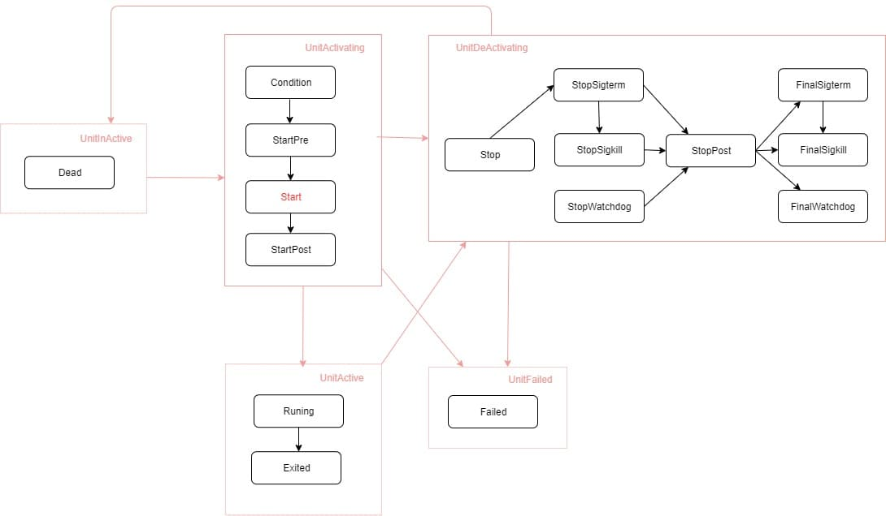
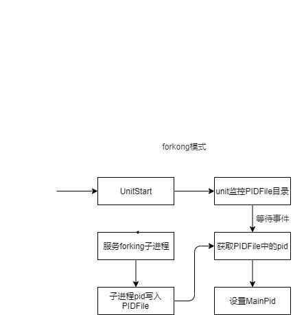

# service设计文档

## 1    概述

service是当前unit类型的一种，用来启动对应的服务， 是服务管理最主要的一种。

### 1.1    目的

service模块主要用来实现服务的启动，实现服务的管理如启动、停止、重启等。

## 2    特性需求概述

表1：特性需求列表

| 需求编号 | 需求名称           | 特性描述                                                                                          | 优先级 |
| -------- | ------------------ | ------------------------------------------------------------------------------------------------- | ------ |
| 1        | Simple     | 启动服务时forking即认为服务已经启动完成 | 高     |
| 2        | Forking  | sysmaster fork的子进程为管理进程， 管理进程退出服务启动成功， 通过pid_file传递进程id                                                    | 高     |
| 3        | Notify | 服务主动通告子进程的状态给sysmaster                                  | 高     |
| 4        | Oneshot | 拉起的服务退出之后即认为服务启动完成                                   | 高     |

## 3    需求场景分析

### 3.1    特性需求来源与价值概述

service是服务管理的主要实现， 用于实现进程或应用的拉起、停止、重启等功能。

## 3.2    特性场景分析

需要拉起进程或应用时使用。

## 3.3    特性影响分析

## 4    特性/功能实现原理

### 4.1    总体方案

整个特性包含9个模块，包括service_base、service_comm、service_config、service_mng、service_spawn、service_pid、service_unit

1. service_base：基础数据结构的定义。

2. service_comm：包括公共数据结构的引用，当前包含UnitManager和Unit的引用。

3. service_config：实现service配置文件的数据结构定义和转换。

4. service_mng： 实现service启动流程的状态转换。

5. service_spawn：实现service执行cmd的入口。

6. service_pid：实现service pid的管理。

7. service_unit：实现socket子类型的定义， 实现UnitObj、UnitSubClass、UnitMngUtil三个trait。

### 4.2    service状态转换图

 

    状态转换包括子类内部的状态转换以及unit整体的状态转换，具体的对应关系如图中所示。

### 4.3    service_forking启动设计

 

启动类型为forking模式时， sysmaster fork出来的子进程为中间管理进程，中间管理进程退出认为服务启动完成， 中间管理进程
退出后再启动对应的主进程。

## 4.4    service_notify启动设计

 

1. sysmaster启动inotify监听套接子， 并将unix套接子的路径传递给子进程。

2. 子进程通过unix套接子通告状态给sysmaster。

### 4.5    特性下的非功能需求设计

NA

## 5可靠性/可用性/Function Safety设计

NA

## 6    安全/隐私/韧性设计

NA

## 7    特性非功能性质量属性相关设计

NA

## 8    数据结构设计（可选）

本章节完成数据库结构的设计（数据库表结构，可以使用Power Designer完成），可选章节。

## 9    词汇表

NA

## 10   其它说明

NA

## 11   参考资料清单

NA
