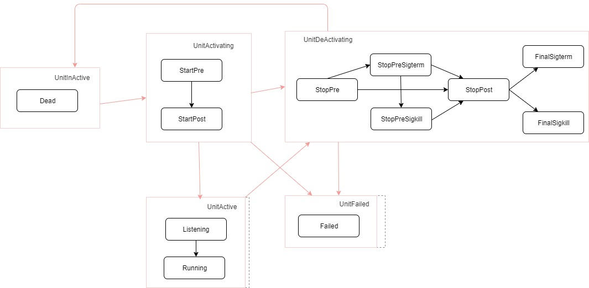
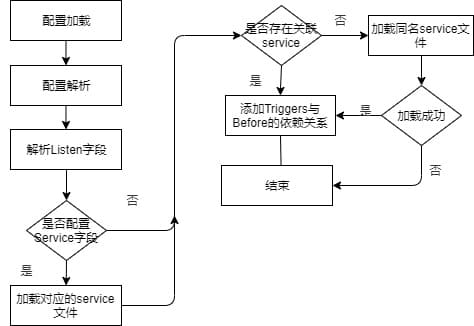
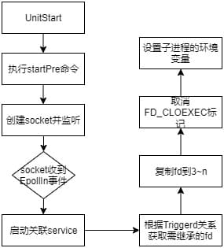

# Socket设计说明书

## 1    概述

socket是当前unit类型的一种，用来创建socket套接字。

### 1.1    目的

socket模块主要用来实现服务的延迟启动，socket优先启动，当对应的socket收到EPOLL_IN事件时， 触发对应的service服务启动。

## 2    特性需求概述

表1：特性需求列表

| 需求编号 | 需求名称           | 特性描述                                                                                          | 优先级 |
| -------- | ------------------ | ------------------------------------------------------------------------------------------------- | ------ |
| 1        | Stream类型套接字     | 支持创建Stream类型的套接字，同时支持IPv4和IPv6。 | 高     |
| 2        | Datagram类型套接字  | 支持创建Datagram类型的套接字， 同时支持IPv4和IPv6                                                    | 高     |
| 3        | Netlink类型套接字 | 支持创建Netlink类型的套接字                                   | 高     |

## 3    需求场景分析

### 3.1    特性需求来源与价值概述

socket类型用来创建套接字，与service解耦， 可以单独启动，当socket有对应的EPOLL_IN事件时候，触发启动对应的service文件，从而提升服务的启动速度。

### 3.2    特性场景分析

当service使用到socket套接字时，可以使用该特性，实现socket与service的并发启动。

### 3.3    特性影响分析

每一个socket文件需要有一个对应的service配置文件。

### 3.4    友商实现方案分析

| 友商     | 特点                                                              |
| -------- | ----------------------------------------------------------------- |
| Systemd  | 当前支持socket类型更多 |

## 4    特性/功能实现原理

### 4.1    总体方案

整个特性包含9个模块，包括socket_base、socket_comm、socket_config、socket_mng、socket_load、socket_spawn、socket_pid、socket_port、socket_unit

1. socket_base：基础数据结构的定义。

2. socket_comm：包括公共数据结构的引用，当前包含UnitManager和Unit的引用。

3. socket_config：实现socket配置文件的数据结构定义和转换。

4. socket_mng： 实现socket启动流程的状态转换。

5. socket_load：实现socket_config配置的解析。

6. socket_spawn：实现socket执行cmd的入口。

7. socket_pid：实现socket内部pid的管理。

8. socket_port：实现socket套接字的管理。

9. socket_unit：实现socket子类型的定义， 实现UnitObj、UnitSubClass、UnitMngUtil三个trait。

### 4.2    socket状态转换图

 

    状态转换包括子类内部的状态转换以及unit整体的状态转换，具体的对应关系如图中所示。

### 4.3    socket_load模块设计

 

    socket_load模块负责Socket Section字段的解析。除了字段的解析之外， 还要建立socket与对应的service的对应的关系。
具体的流程见上图。

### 4.4    socket_start模块设计

 

    socket的start主要分为两步：

1. 创建对应的socket套接字， 并监听。

2. socket接收EPOLL_IN事件， 启动对应的service.

### 4.5    特性下的非功能需求设计

NA

## 5    可靠性/可用性/Function Safety设计

NA

## 6    安全/隐私/韧性设计

NA

## 7    特性非功能性质量属性相关设计

NA

## 8    数据结构设计（可选）

本章节完成数据库结构的设计（数据库表结构，可以使用Power Designer完成），可选章节。

## 9    词汇表

NA

## 10   其它说明

NA

## 11   参考资料清单

NA
