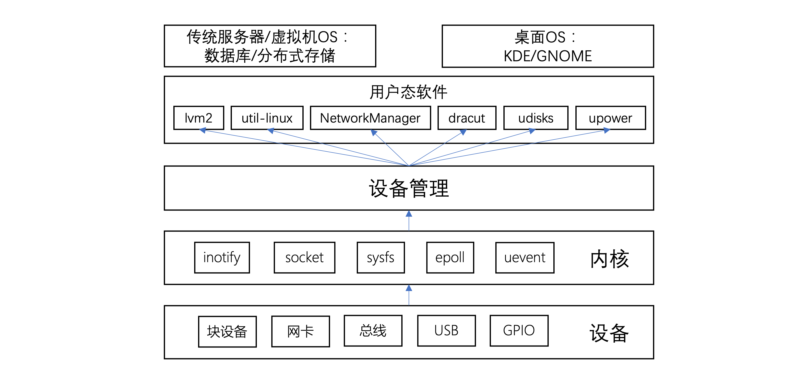
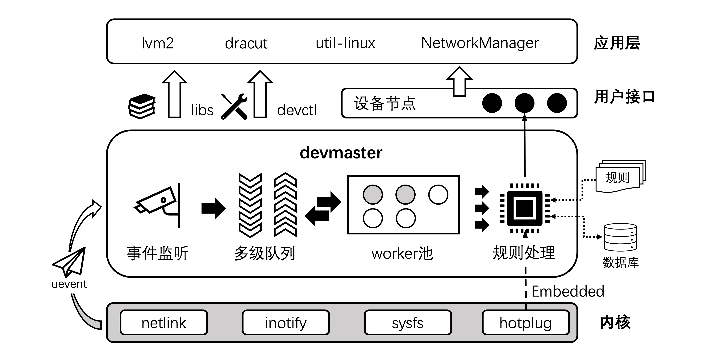
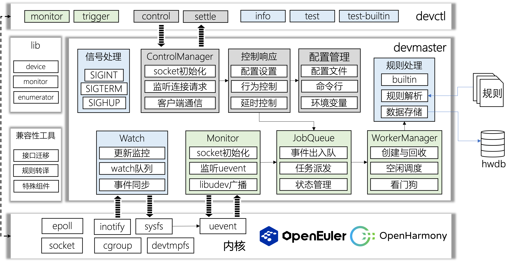

# devMaster: 新一代设备管理器

## 认识`Linux`的设备管理器和`devMaster`

设备管理器承担着设备热插拔处理、设备节点创建与更新等操作，是系统初始化流程中必不可少的一个环节。`devMaster`作为`sysMaster`的设备管理模块，是支撑系统快速启动、保证系统功能正常运行的重要功能组件。

设备管理器作为链接用户态软件与底层物理设备的桥梁，支撑着许多用户态基础软件，比如`lvm2`、`NetworkManager`等等，是系统用户态的核心组件之一。`Linux`的设备管理机制划分为内核态和用户态：内核承担设备发现的功能，并通过`sysfs`下的`kobject`提供设备信息查询以及与内核交互的接口，另外内核会通过`netlink`通知用户态进程，或者使用`hotplug`机制直接调用用户态程序；用户态设备管理器，比如主流的`udev(userspace device)`，监听内核上报的设备事件，并根据设备属性执行一系列灵活的管理动作，总体来看具备以下几类功能：

1. 管理静态设备节点：但是随着`devtmpfs`在`2009`年收录进`Linux 2.6.32`，静态设备节点由内核进行创建，令一般启动程序不必等待`udev`。
2. 设备命名映射：内核创建的设备节点，比如`/dev/sda`，往往不具备直观可理解的名称，而`udev`可以提供一种类似`DNS`的命名映射机制，将设备映射到固定可理解的名称上。
3. 网卡保序：服务器可能通过板载集成、`PCIe`插槽扩展等方式，持有多块网卡，而内核发现并命名网卡的编号具有随机性，导致网卡节点的名称无法对应物理顺序，`udev`通过读取网卡所在的`PCI`总线号、插槽索引等固定信息，将网卡名称固定到特定编号上。
4. 控制设备节点的权限、动态分配设备的主/次设备号等等。

在不同的应用场景下，设备管理器提供的能力也会相应地扩展或裁剪。例如，在嵌入式和移动终端场景下，设备数量和种类相对固定且计算资源有限，因此设备管理器更趋向于功能精简和场景定制化，比如`mdev`仅支持热插拔时的设备节点更新、`vold`仅提供可插拔存储设备的挂载卸载功能等。而在通用服务器和桌面`OS`上，由于物理设备种类丰富、数量众多，且上层应用的业务逻辑更加复杂，这要求设备管理器提供更高的灵活性和可扩展性。

| 设备管理器   | 应用场景      | 说明                                                                     | 热插拔 | 并发处理 | 支持通用设备 | 策略定制 | 更新同步 |
| ------------ | ------------- | ------------------------------------------------------------------------ | ------ | -------- | ------------ | -------- | -------- |
| `android vold` | 移动终端设备  | 支持对可插拔存储设备的挂载和卸载管理                                     | ✔️      | ✔️        |              |          |          |
| `busybox mdev` | 嵌入式设备    | 利用内核的`hotplug`回调机制触发设备节点更新                                | ✔️      | ✔️        | ✔️            |          |          |
| `systemd udev` | 服务器/桌面`PC` | 主流的用户态设备管理器，具备良好的可扩展性，支持上层软件定制设备处理规则 | ✔️      | ✔️        | ✔️            | ✔️        | ✔️        |

`udev`作为极具代表性的通用OS用户态设备管理器，基本占据了主流的`Linux`发行版平台。相比于早期内核态的设备管理方案`devfs/devtmpfs`，`udev`提供更灵活、更强大的定制化设备处理能力，比如创建设备软链接、持久化命名、网卡保序等等，使得上层软件可以更灵活、更方便地实现业务逻辑。但是随着`HAL(hardware abstraction layer)`和`udev`的功能整合，以及后续`udev`与`systemd`项目的合并，`udev`的功能越来越臃肿，越来越依赖于`systemd`的初始化系统生态，这违背了软件设计的分层解耦原则，导致其他软件被强行绑定到`systemd`生态中。

`sysMaster`项目作为`openEuler`对新一代系统初始化和服务管理系统的探索，集成设备管理功能是必不可少的。`devMaster`作为`sysMaster`的设备管理组件，一方面支撑`sysMaster`的快速启动以及用户态软件的生态兼容，另一方面通过对`Linux`生态下主流设备管理方案的现状和优劣进行了总结和思考，希望提供一种分层解耦、可扩展性强、面向通用`OS`的设备管理能力。

## `devMaster`的愿景与原理

作为系统初始化以及常态运行下关键的系统功能，用户态设备管理器需要具备极高的可靠性、运行效率以及可扩展性，是支撑虚拟机/物理机启动与运行必不可少的系统组件。因此，`devMaster`的目标主要包含以下几点：

1. 消除系统层面的内存安全问题，降低高并发场景下的设备竞争的负面影响，提高设备管理器的可靠性和鲁棒性。
2. 南向兼容`Linux`和鸿蒙微内核生态，北向兼容现有用户态软件的`udev`规则配置和`libudev`动态库接口调用，支持无缝迁移`devMaster`工具链。
3. 采用分层解耦的软件设计，保证设备管理器的轻量级、高效率，同时具备极致的可扩展能力。

`devMaster`的软件架构遵循高内聚、低耦合的设计原则，保证各组件职责独立，提高软件可复用、可替换、可扩展能力，降低开发维测成本。`devMaster`主要包含四部分组件，分为常驻进程`devmaster`、客户端工具`devctl`、对外库以及兼容性工具。`devMaster`使用`Rust`语言编写，能够原生消除内存安全类问题。`devMaster`的核心原理如下：

1. 事件驱动：实时监听设备热插拔事件，并利用队列分级技术，满足事件高并发场景，缓解设备竞争问题，同时使用`worker`池机制支撑事件并发处理能力，提高事件处理的吞吐量，支撑秒级启动能力。
2. 机制与策略分离：通过将事件处理的行为定义在外部规则文件中，避免设备处理逻辑硬编码，并支持设备规则按需组合、定制、裁剪，提供灵活、强大的可扩展能力。
3. 可维可测：通过客户端工具`devctl`提供对`devmaster`的用户端控制接口，提升`devmaster`的可维可测能力，并兼容`udevadm`选项，支持用户使用习惯的平滑迁移。
4. `Rust`工具链：对外库提供开发者获取硬件设备信息以及与`devmaster`交互的对外接口，完善`Rust`语言在设备管理领域的三方库与工具链。
5. 生态兼容：提供完善的南北向兼容性工具，比如`udev`规则转译工具、对外库的`Rust2C`接口迁移、特殊设备组件等，支持`udev`到`devMaster`生态的无缝迁移。依托欧拉鸿蒙生态，打通嵌入式/物理机/虚拟机OS全场景。

总的来说，`devMaster`的设计旨在简化系统架构，并通过多项关键技术确保设备管理器具备机制的可扩展性、可靠性、可维可测能力、软件性能以及生态兼容能力，是一款非常有价值的设备管理工具。

## `devMaster`全景图

今年`sysMaster`将聚焦系统快速启动能力，而`devMaster`作为支撑快速启动的核心功能组件，在`2022年12月份`完成了顶层设计并规划了预计3个季度的开发路标，`2023年1月份`期间`devMaster`在`sysMaster`项目中贡献了第一次提交并自此开始了正式的编码工作。`devMaster`目前仍处于快速迭代，在第一个季度中，我们已完成了事件驱动的软件运行框架编码，包括事件监听模块、事件队列模块和worker池，另外我们也完成了`libdevice`库的主体功能以及`devctl`部分子命令的开发。在第二个季度中，我们重点投入规则处理模块，目前已支持规则加载以及部分规则执行功能，并且将在后续引入`devctl`的用户调测接口。第三个季度，我们计划完成余下的诸如配置管理、控制管理、节点监控、兼容性工具等特性编码，并逐步嵌入`initramfs`启动以及主系统初始化流程，支撑物理盘、逻辑卷、PXE等不同系统启动需求，最终覆盖物理机、虚拟机等全场景的快速启动能力。
