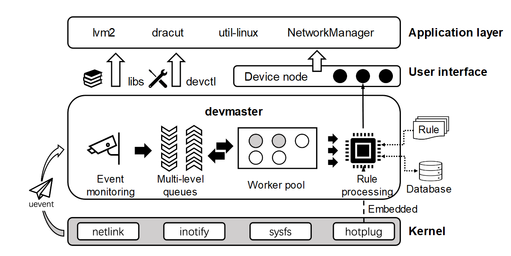

# Device Management

The device manager is a bridge between user-mode software and underlying physical devices, supporting the operation of key base software such as lvm2 and NetworkManager. As the device management component of sysMaster, devmaster supports quick startup of sysMaster and ecosystem compatibility of user-mode software. In addition, devmaster provides layered, decoupled, and scalable device management capabilities for common OSs based on the summary and contemplation of mainstream Linux device management solutions.

devmaster consists of a daemon, a client tool, and a dynamic library. The devmaster daemon utilizes kernel mechanisms such as netlink, inotify, and sysfs to monitor device events and trigger rule processing tasks. The `devctl` client tool and **libs** dynamic library provide a set of CLI commands and public interfaces for debugging rules, controlling daemons, and querying device status. The following figure shows the overall architecture of devmaster.

**Figure 1 devmaster overall architecture**

devmaster is written in the Rust language to ensure memory safety. The core functions of devmaster are as follows:

1. Event-driven operations: The queue cache and worker pool mechanisms are used to meet the requirements of highly concurrent device events. In addition, user-mode processes can be dynamically notified of the readiness of devices.
2. Separation of mechanisms and policies: Device processing logic is defined as rules rather than hard-coded in service code, allowing for on-demand customization and flexible combination.
3. Ecosystem compatibility: devmaster is compatible with the udev syntax and udev user-mode broadcast protocol. Existing services can be migrated to the devmaster environment with low costs.
