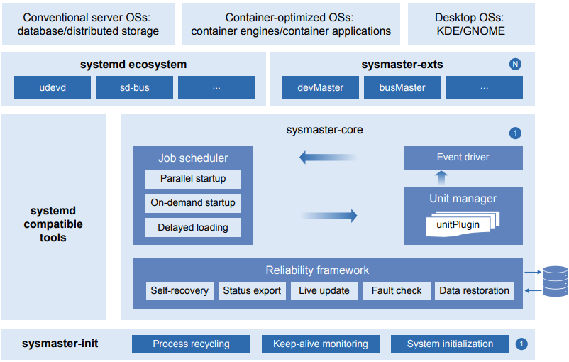

# sysMaster User Guide

## Overview

sysMaster is a collection of ultra-lightweight and highly reliable service management programs. It provides an innovative implementation of PID 1 to replace the conventional init process. Written in Rust, sysMaster is equipped with fault monitoring, second-level self-recovery, and quick startup capabilities, which help improve OS reliability and service availability.

sysMaster supports unified management of processes, containers, and VMs and applies to multiple scenarios such as servers, cloud computing, and embedded systems.

sysMaster divides the functions of traditional PID 1 into a 1+1+N architecture based on application scenarios.

As shown in the figure, sysMaster consists of three components: 

- sysmaster-init, which is a new implementation of PID 1, features simplified functions, a thousand lines of code (KLOC), and ultimate reliability. It is applicable to embedded systems with functions such as system initialization, zombie process recycling, and keep-alive monitoring. 
- sysmaster-core undertakes the core service management functions and incorporates the reliability framework to enable live updates and quick self-recovery in the event of crashes, ensuring 24/7 service availability. 
- sysmaster-exts offers a set of components (such as devMaster for device management and busMaster for bus communication) that deliver key system functions, which are coupled in traditional PID 1. Users can choose the components to use as required.

**Figure 1** sysMaster architecture

**sysmaster** and **devmaster** are the two main packages of sysMaster, which are responsible for service management and device management, respectively.

## Intended Audience

This document is intended for openEuler users who need to manage services and devices. The users are expected to:

- Know basic Linux operations.
- Know service configuration and devices.
