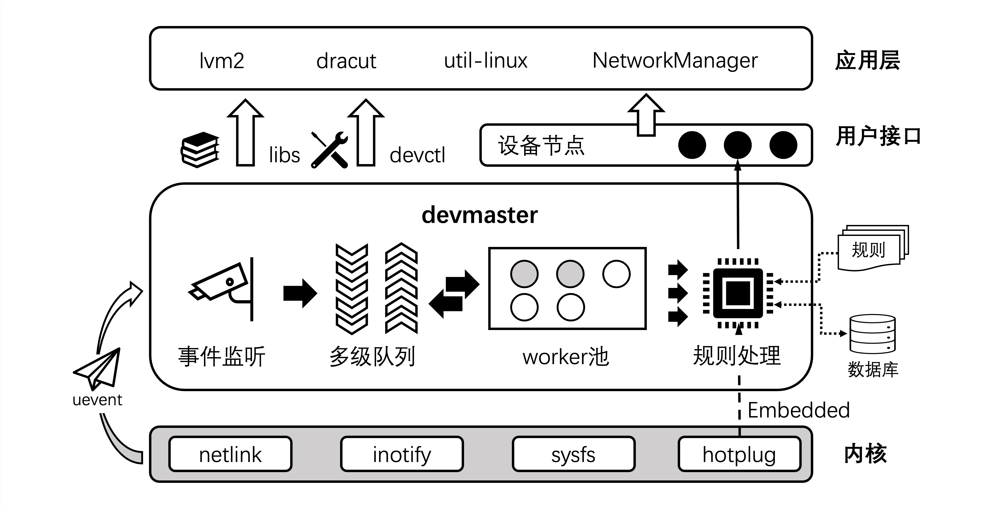

# 设备管理

设备管理器作为链接用户态软件与底层物理设备的桥梁，支撑着 `lvm2`、`NetworkManager`等关键基础软件的运作。`devmaster`作为 `sysMaster`的设备管理组件，一方面支撑 `sysMaster`的快速启动以及用户态软件的生态兼容，另一方面通过对 `Linux`生态下主流设备管理方案的现状和优劣进行了总结和思考，从而提供一种分层解耦、可扩展性强、面向通用 `OS`的设备管理能力。

`devmaster`由常驻进程、客户端工具和动态库组成。常驻进程`devmaster`基于内核提供的`netlink`、`inotify`、`sysfs`等机制，监听设备事件并触发规则处理任务；客户端工具`devctl`和动态库`libs`提供一组命令行指令以及公开接口，用于调试规则、控制常驻进程、查询设备状态等等。`devmaster`的总体架构如下图所示：

**图1 devMaster的总体架构**

`devmaster`使用 `Rust`语言编写，能够原生消除内存安全类问题。`devmaster`的核心功能如下：

1. 事件驱动：利用队列缓存和 `worker`池机制，满足设备事件高并发的场景，并支持将设备就绪状态动态地通知到用户态进程。
2. 机制与策略分离：将设备处理逻辑定义在规则中，避免业务硬编码，提供按需定制、灵活组合的能力。
3. 生态兼容：良好地兼容 `udev`语法和 `udev`用户态广播协议，支持原有业务低成本迁移到 `devmaster`环境。
