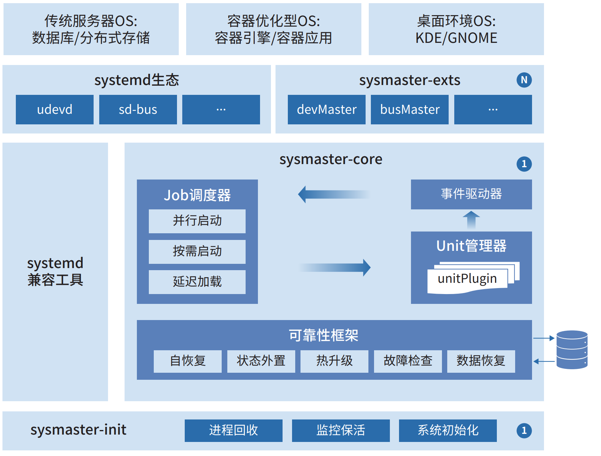

# sysMaster用户指南

## 概述

`sysMaster`是一套超轻量、高可靠的服务管理程序集合，是对 `1`号进程的全新实现，旨在改进传统的 `init`守护进程。它使用 `Rust`编写，具有故障监测、秒级自愈和快速启动等能力，从而提升操作系统可靠性和业务可用度。

`sysMaster`支持进程、容器和虚拟机的统一管理，其适用于服务器、云计算和嵌入式等多个场景。

`sysMaster`实现思路是将传统 `1`号进程的功能解耦分层，结合使用场景，拆分出 `1+1+N`的架构。

如下面 `sysMaster`系统架构图所示，主要包含三个方面:  
• `sysmaster-init`：新的 `1`号进程提供系统初始化、僵尸进程回收、监控保活等功能，可单独应用于嵌入式场景。  
• `sysmaster-core`：承担原有服务管理的核心功能，引入可靠性框架，使其具备崩溃快速自愈、热升级等能力，保障业务全天在线。  
• `sysmaster-exts`：使原本耦合的各组件功能独立，提供系统关键功能的组件集合（如设备管理 `devMaster`，总线通信 `busMaster`等），各组件可单独使用，可根据不同场景灵活选用。  

**图1** sysMaster整体架构图

`sysMaster`目前主要由 `sysmaster`和 `devmaster`2部分功能组成，其中 `sysmaster`负责服务的管理，`devmaster`负责设备的管理，下面将对这2部分功能进行说明。

## 读者对象

本文档主要适用于使用 `openEuler`并需要对服务和设备进行管理的用户。用户需要具备以下经验和技能：

* 熟悉 `Linux`基本操作
* 对服务配置和设备有一定了解
